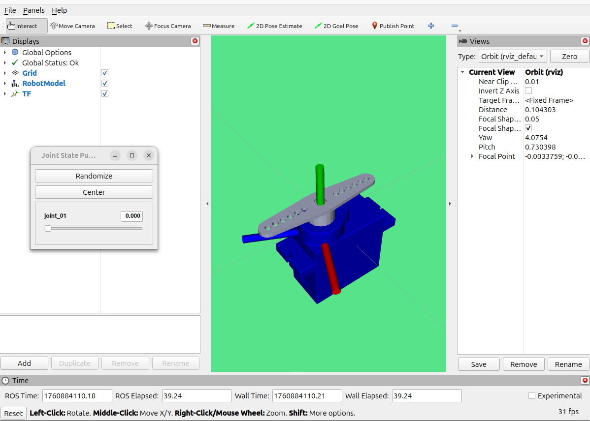
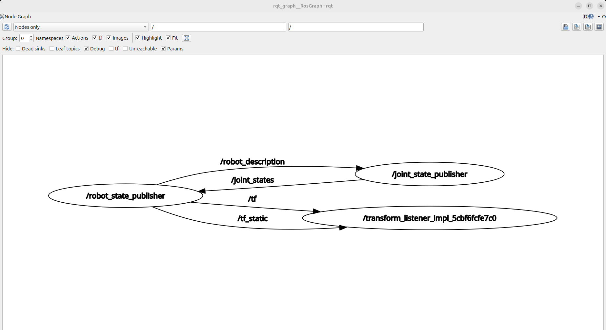
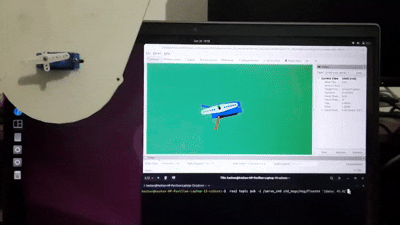

# ROS-2-Jazzy-micro-ROS-Workshop
ROS2-jazzy, Rviz, micro_ROS, ESP32 (Overview for the workshop)

Task 01
=======
Developing URDF models using only simple geometry primitives like box, cylinder, and sphere becomes impractical as robot complexity increases. For accurate Gazebo simulation you need 3D models that closely match the real robot. For that reason, we can use a SolidWorks-to-URDF exporter to create robot models with complex geometry. (Simple URDF models remain important because URDF has limitations, for example in modeling closed-loop joints.)

Install sw_urdf_exporter and set up the assembly
------------------------------------------------
- Install the sw_urdf_exporter add-in. Follow the official guide here: [https://wiki.ros.org/sw_urdf_exporter](https://wiki.ros.org/sw_urdf_exporter)
- Download the servo_motor from the repository and open the assembly file servo_assembly.SLDASM in SolidWorks. Inspect the assembly to understand the defined links and mates.
- In SolidWorks, navigate to Tools -> Export as URDF to run the exporter.

Configure base link and child links
-----------------------------------
- Select the base_link geometry and assign it as the base link.
- Set the number of child links to 1.
- Rename the empty link to link_01 and the corresponding joint to joint_01.
- For joint_01 choose type revolute_joint and set its related geometry to LINK_1.

Preview and export
------------------
- Click Preview, then click Export. This will apply the changes and open a new window.
- In the new window, review and confirm joint parameters and link properties.
- When everything is correct, choose Export URDF and Meshes.
- Save the output as servo_description in a suitable folder on your system.

Build a ROS 2 package from the exported URDF
--------------------------------------------
The exporter produces a ROS 1-style package layout and launch files. ROS 2 uses different package manifests, build tools, and launch conventions, so you must repackage and adapt the files before trying to visualize or simulate.
- Create a new package in your ROS 2 workspace called servo_description.
- Copy the exported URDF and the meshes folder from the SolidWorks exporter into your new package.
- Follow the step-by-step guide in ROS2-Jazzy-Workshop-01 notes to visualize the model in rviz2. That guide covers the exact commands and launch files required for Jazzy.

TASK 02
=======
In this task, We will use powerful, built-in ROS 2 command-line tools to:

1. Visually map the relationship between our running nodes.
2. List all active communication channels (Topics).
3. Inspect the specific data structure (Message Type) of our servo's topic.
4. "Listen" to the raw data being published to the topic in real-time.

This process, known as **introspection**, is a fundamental skill for debugging and understanding any ROS-based robotic system.

Prerequisites
-------------
- You must have the launch file from TASK 01 running in a terminal.

Visualizing the Node Graph with rqt_graph
-----------------------------------------
ROS 2 system is a graph of processing units (Nodes) that communicate over topics. The rqt_graph tool provides a live, visual representation of this graph.

1. Open a new, sourced terminal.
2. Run the following command to start the RQT graph tool:

       rqt_graph

Listing All Active Topics
-------------------------
While rqt_graph is visual, we can get a quick and simple text list of all topics currently advertised in the system.

Run the topic list command:

       ros2 topic list

Inspecting a Topic's Message Type
---------------------------------
A topic is a typed channel. It can only transmit data that adheres to a specific, predefined structure, known as a message type. We must know this type to understand the data being sent.

In your terminal, use the topic info command to inspect our topic of interest:

       ros2 topic info /joint_states

"Echoing" Live Topic Data
-------------------------
Now that we know the topic exists and what message type it uses, we can use the echo command to print the raw data from the topic directly to our console in real-time.

In your terminal, run the topic echo command:

       ros2 topic echo /joint_states

In this task, you have used powerful ROS 2 introspection tools to dissect the communication happening "under the hood".

Pay close attention to the **/joint_states** topic. As you saw, this is the topic RViz uses to get the servo's position and visualize it.

Understanding this topic is important because our final goal is to use micro-ROS to publish the real hardware joint states from a physical servo. We will publish that hardware data to this exact same /joint_states topic, replacing the virtual GUI. This task shows you the data format and topic name you will need to use later.

# Introduction to micro-ROS

micro-ROS is a variant of ROS 2 designed specifically for deeply embedded robotic systems. Its main goal is to bring ROS concepts such as nodes, publishers/subscribers, services, lifecycle and node graph directly onto microcontrollers (MCUs). This allows low-level firmware devices (ex: sensors, motor drivers, control nodes) to fully participate in the ROS 2 ecosystem instead of acting merely as simple data producers/consumers.

Unlike standard ROS 2, which assumes a Linux environment and comparatively large compute resources, micro-ROS targets resource-constrained microcontrollers that often have only tens or hundreds of kilobytes of RAM. This is achieved by replacing the full DDS middleware with DDS-XRCE, a transport designed for Extremely Resource Constrained Environments.

## 1. Key Features

micro-ROS provides a set of capabilities that enable ROS-style behavior in embedded devices:

- A microcontroller-optimized client API based on rcl and rclc, supporting deterministic execution and eliminating dynamic memory allocation after initialization.
- Seamless integration with ROS 2, meaning micro-ROS nodes appear like any other ROS 2 nodes via the Agent.
- A highly lightweight middleware (DDS-XRCE) that drastically reduces resource usage.
- Support for multiple real-time operating systems (RTOS) such as FreeRTOS, Zephyr and NuttX, instead of Linux.
- A permissive open-source license suitable for both academia and industry.
- A growing and actively maintained community ecosystem.
- Long-term interoperability and maintainability thanks to architectural alignment with ROS 2.

## 2. Architecture Overview

micro-ROS follows the same layered structure as ROS 2 but adapts two main parts of the stack:

**Middleware →** Full DDS is replaced with DDS-XRCE  
**Operating System →** Linux is replaced with a lightweight RTOS

A micro-ROS system consists of:

- A micro-ROS Client (running on the MCU)
- A micro-ROS Agent (running on a ROS 2 host machine)

The Agent bridges the communication between the embedded device and the full ROS 2 graph. Communication between Client and Agent can happen over UART, USB, Wi-Fi or UDP/Ethernet, depending on hardware.

## 3. Hardware Support

micro-ROS targets mid-range 32-bit MCUs with:

- Tens of kilobytes of RAM or more
- A supported transport (UART, USB-CDC, Ethernet/Wi-Fi)

There are two hardware categories:

- **Officially supported boards** (tested and maintained with LTS support)
- **Community supported boards** (user-contributed)

Some examples of officially supported boards include ESP32, Raspberry Pi Pico RP2040, Arduino Portenta H7, ROBOTIS OpenCR, Teensy 3/4 families, STM32 IoT Discovery boards and Renesas RA6M5 platforms. These cover FreeRTOS, Zephyr, NuttX, Arduino and vendor-specific SDKs.

Community-supported options include Arduino Due/Zero and ST NUCLEO development boards.

## 4. Comparison with Other Approaches

Before micro-ROS, the most common method of connecting microcontrollers to ROS was rosserial, which only supports ROS 1 and offers limited ROS features (no lifecycle nodes, no timers, no standard middleware). RIOT-ROS2 attempted to port a partial ROS 2 stack directly into RIOT OS, but its development has stalled since 2018.

micro-ROS differs because it:

- Uses the standard ROS 2 stack (up to rcl)
- Uses an officially supported embedded middleware (DDS-XRCE)
- Supports RTOS scheduling and ROS-style lifecycle
- Is actively maintained with LTS guarantees

## 5. ROS 2 Feature Comparison

micro-ROS aims to preserve as much of the standard ROS 2 programming model as possible while adapting it to the constraints of microcontrollers. Many core ROS 2 features are available in micro-ROS, though some are simplified or still under development due to MCU limitations.

At a high level, micro-ROS supports the essential ROS 2 concepts — nodes, publishers/subscribers, services, actions, lifecycle and discovery — but with restrictions such as fixed-size messages and compile-time composition. In place of the full DDS middleware, micro-ROS relies on DDS-XRCE, a transport specifically designed for extremely resource-constrained devices.

### Features well supported in micro-ROS

- Core client library: Built on rcl from ROS 2, extended with rclc for deterministic, allocation-free runtime on MCUs.
- Lifecycle nodes: Supported via rclc_lifecycle, enabling managed startup and shutdown behavior.
- Publish/subscribe, services and actions: Fully available, as long as message types are fixed-size.
- Discovery and node graph information: Works the same way as ROS 2 (with additional discovery options to find Agents).
- DDS-XRCE transport: Provides UDP, serial (UART) and custom transport support.
- Quality of Service (QoS): Reliable and best-effort semantics are available at compile-time.
- IDL type support: micro-ROS supports the same IDL definitions as ROS 2.

### Features partially available or still in progress

- Parameter system: The parameter server exists on the client, but the parameter client is not implemented yet.
- Inter/intra-process communication: Available, but thread-safety depends on middleware and MCU context.
- Peer-to-peer communication: Prototype exists using broadcast but currently without QoS guarantees.
- High-resolution timers: Dependent on OS/hardware timer support; POSIX timers are low precision on some MCUs.

### Features not yet available or RTOS-dependent

- Launch system for MCU nodes: Not currently supported; coordination depends on the RTOS.
- DDS security on the client side: Only available on Agent/DDS side for now; security for Client–Agent communication is planned.
- Simulation time: May work but not guaranteed, especially for hardware-in-the-loop setups.

For further details and the complete feature overview, refer to the official documentation at https://micro.ros.org/docs/overview/features/

Installing micro-ROS
====================
follow the instructions detailed [here](https://micro.ros.org/docs/tutorials/core/first_application_linux/).

    # Create a workspace and download the micro-ROS tools
    mkdir microros_ws
    cd microros_ws
    git clone -b $ROS_DISTRO https://github.com/micro-ROS/micro_ros_setup.git src/micro_ros_setup
    
    # Update dependencies using rosdep
    sudo apt update && rosdep update
    rosdep install --from-paths src --ignore-src -y
    
    # Install pip
    sudo apt-get install python3-pip
    
    # Build micro-ROS tools and source them
    colcon build
    source install/local_setup.bash

These instructions will setup a workspace with a ready-to-use micro-ROS build system. This build system is in charge of downloading the required cross-compilation tools and building the apps for the required platforms.

Creating a new firmware workspace
--------------------------------
Once the build system is installed, let’s create a firmware workspace that targets all the required code and tools:

    ros2 run micro_ros_setup create_firmware_ws.sh host
For the user to create a custom application, a folder <my_app> will need to be registered in this location, containing the two files just described. Also, any such new application folder needs to be registered in src/uros/micro-ROS-demos/rclc/CMakeLists.txt by adding the following line:

    export_executable(<my_app>)

Building the firmware
---------------------

Once the app has been created, the build step is in order. given that we are compiling micro-ROS in the host machine rather than in a board, the cross-compilation implemented by the configuration step is not required in this case. We can therefore proceed to build the firmware and source the local installation:

    ros2 run micro_ros_setup build_firmware.sh
    source install/local_setup.bash

Creating the micro-ROS agent
---------------------------
The micro-ROS app is now ready to be connected to a micro-ROS agent to start talking with the rest of the ROS 2 world. To do that, let’s first of all create a micro-ROS agent:

    ros2 run micro_ros_setup create_agent_ws.sh
Now, let’s build the agent packages and, when this is done, source the installation:

    ros2 run micro_ros_setup build_agent.sh
    source install/local_setup.bash    
Add micro-ROS environment to bashrc 
-----------------------------------
You can add the ROS 2 and micro-ROS workspace setup files to your .bashrc so the files do not have to be sourced every time a new command line is opened.

    echo source ~/microros_ws/install/local_setup.bash >> ~/.bashrc

Running the micro-ROS app
-------------------------
To give micro-ROS access to the ROS 2 dataspace, run the agent:

- Serial (USB / UART):

        ros2 run micro_ros_agent micro_ros_agent serial --dev /dev/ttyACM0
- Wi-Fi / Ethernet (UDP):

        ros2 run micro_ros_agent micro_ros_agent udp4 --port 8888

Setting up the Arduino IDE for micro-ROS
----------------------------------------
To enable micro-ROS development using Arduino boards, 
- open the Arduino IDE, navigate to Sketch -> Include Library -> Manage Libraries
- then search for [micro_ros_arduino](https://github.com/micro-ROS/micro_ros_arduino).
- Install the version compatible with your ROS 2 distribution.

Task 03
=======
In this task, we will program our ESP32 to act as a ROS 2 node. This node will be responsible for two key actions:

1. Subscribing to the servo_cmd topic to receive angle commands from the main ROS 2 system.
2. Publishing the servo's current position to the /joint_states topic, allowing RViz to visualize the real hardware state.

You can find the complete, final code for this task in [here](https://github.com/heshan-madusanka/ROS-2-Jazzy-micro-ROS-Workshop/tree/main/micro-ROS-servo).

Now that we understand the code, let's get it running on the hardware.

Upload the Code to the ESP32
-----------------------------
1. Open your Arduino IDE.
2. Create a new, empty sketch (File > New).
3. Go to the workshop's GitHub repository [here](https://github.com/heshan-madusanka/ROS-2-Jazzy-micro-ROS-Workshop/blob/main/micro-ROS-servo/micro-ROS-servo.ino) and copy the entire ESP32 servo code.
4. Paste the code into your new sketch, completely replacing the default setup() and loop() functions.
5. In the Arduino IDE, go to Tools > Board and select your ESP32 board model.
6. Go to Tools > Port and select the serial port your ESP32 is connected to (e.g., /dev/ttyACM0 or /dev/ttyUSB0 on Linux, COM3 on Windows).
7. Click the Upload button (the right-arrow icon) to compile and flash the code to your ESP32. Wait for it to complete.

Connect the Hardware
--------------------
Connect the servo motor to the ESP32. Ensure your wiring is correct to avoid damaging your components.
- Servo GND (Brown/Black): Connect to a GND pin on the ESP32.
- Servo VCC (Red): Connect to the VIN or 5V pin on the ESP32 (this provides 5V from the USB connection).
- Servo Signal (Orange/Yellow): Connect to the pin you defined in the code (e.g., Pin 13).

Start the micro-ROS Agent
-------------------------
For the ESP32 (client) to talk to the ROS 2 world (computer), we must run the micro-ROS Agent. In this workshop, we use the serial/USB connection as the communication bridge.

1. Open a new, sourced terminal on your computer.
2. Run the following command to start the agent. This command tells the agent to listen for a connection on the specified serial port.

       ros2 run micro_ros_agent micro_ros_agent serial --dev /dev/ttyACM0
   - Note: If your port is different (e.g., /dev/ttyUSB0), change the --dev argument to match.
3. The agent will start and wait. Now, press the "EN" (Enable) or "RST" (Reset) button on your ESP32.
4. Watch the agent's terminal. You should see output confirming a client has connected, and you'll see session information.

Verify the Node from ROS 2
--------------------------
Now that the agent is running and the ESP32 is connected, our node should be live in the ROS 2 system.
1. Open a new, separate terminal (leave the agent running!).
2. First, let's check the topic list:

       ros2 topic list
You should now see our two new topics:
- /joint_states (being published by the ESP32)
- /servo_cmd (which the ESP32 is subscribed to)

Test the System
---------------
Let's send a command from our computer to the ESP32 and see the servo move.
1. Open one more new terminal and source ROS 2.
2. Type (or copy) the following command to publish a single message to the servo_cmd topic, telling it to go to 90 degrees.

       ros2 topic pub -1 /servo_cmd std_msgs/msg/Float64 "{data: 90.0}"
- -1 means "publish one message and exit."
- std_msgs/msg/Float64 is the message type.
- "{data: 90.0}" is the data payload, setting the angle to 90.

3. Look at your hardware. The servo motor should immediately move to the 90-degree position.
4. Try it again with a different value. Press the Up Arrow in your terminal to get the last command and change the data

Task 04
=======
In this final task, we will create a new launch file that removes the simulator and relies entirely on our micro-ROS node as the source of truth for the robot's state. When we run this, commands sent from our computer will move the physical servo, and the servo's actual position will be broadcast back and visualized in RViz, completing the full communication loop.

Create a New Launch File
------------------------
1. Navigate to the launch folder inside your servo_description package. From your workspace
2. Create a new, empty launch file named **servo_control.launch.xml**.

Modify the Launch File
----------------------
Our goal is to create a launch configuration that does everything display.launch.xml did, except for running the GUI simulator.
1. Copy the entire content from display.launch.xml and paste it into the empty servo_control.launch.xml.
2. n servo_control.launch.xml, find and delete the following line:

       <node pkg="joint_state_publisher_gui" exec="joint_state_publisher_gui" />
We are removing this because the joint_state_publisher_gui node is the simulation slider. Our ESP32 is now publishing the /joint_states topic, so we don't want the simulator running and interfering.
3. Build and Source the Workspace:Since we've added a new file to our package, we need to build our workspace so ROS 2 can find it.

Launch and Test the Complete System
-----------------------------------
Now for the final test. We will have three terminals running: the micro-ROS agent, our new launch file, and a third for publishing commands.

- **Terminal 1**: Make sure your ESP32 is plugged in. Start the micro-ROS Agent and press the ESP32's reset button to connect, just as you did in TASK 03.

        ros2 run micro_ros_agent micro_ros_agent serial --dev /dev/ttyACM0
- Terminal 2: Launch your new servo_control.launch.xml file.

       ros2 launch servo_description servo_control.launch.xml
  An RViz window will open. The model's initial position should be 0, matching the hardware.
- Terminal 3: Publish a command to move the servo to 45 degrees.

       ros2 topic pub -1 /servo_cmd std_msgs/msg/Float64 "{data: 45.0}"
  Observe the result: The moment you press Enter, you should see the physical servo motor and the 3D model in RViz move to the 45-degree position at the same time.

Exercise: Create a C++ Servo Sweeper Node
=========================================
So far, you have controlled the servo by manually publishing a single command at a time using ros2 topic pub. This is great for testing but not for autonomous behavior.

Your challenge is to write a standalone C++ ROS 2 node that, when run, will automatically and continuously sweep the servo motor back and forth. This exercise will teach you the fundamentals of creating your own C++ publisher node from scratch.

Create a new ROS 2 C++ node that:
---------------------------------

- Publishes messages of type std_msgs/msg/Float64 to the /servo_cmd topic.
- Continuously sweeps the servo angle from 0 to 180 degrees, and then back from 180 to 0 degrees.
- The sweep should happen in increments of 5 degrees.
- There must be a short delay between each 5-degree step to give the servo time to move smoothly.

Getting Started: Your Guide
---------------------------
This task is very achievable by following and adapting the official ROS 2 documentation.
- Primary Reference: Your main guide for this task is the official tutorial: [Writing a simple publisher and subscriber (C++)](https://docs.ros.org/en/jazzy/Tutorials/Beginner-Client-Libraries/Writing-A-Simple-Cpp-Publisher-And-Subscriber.html). You will only need to implement the publisher part.
